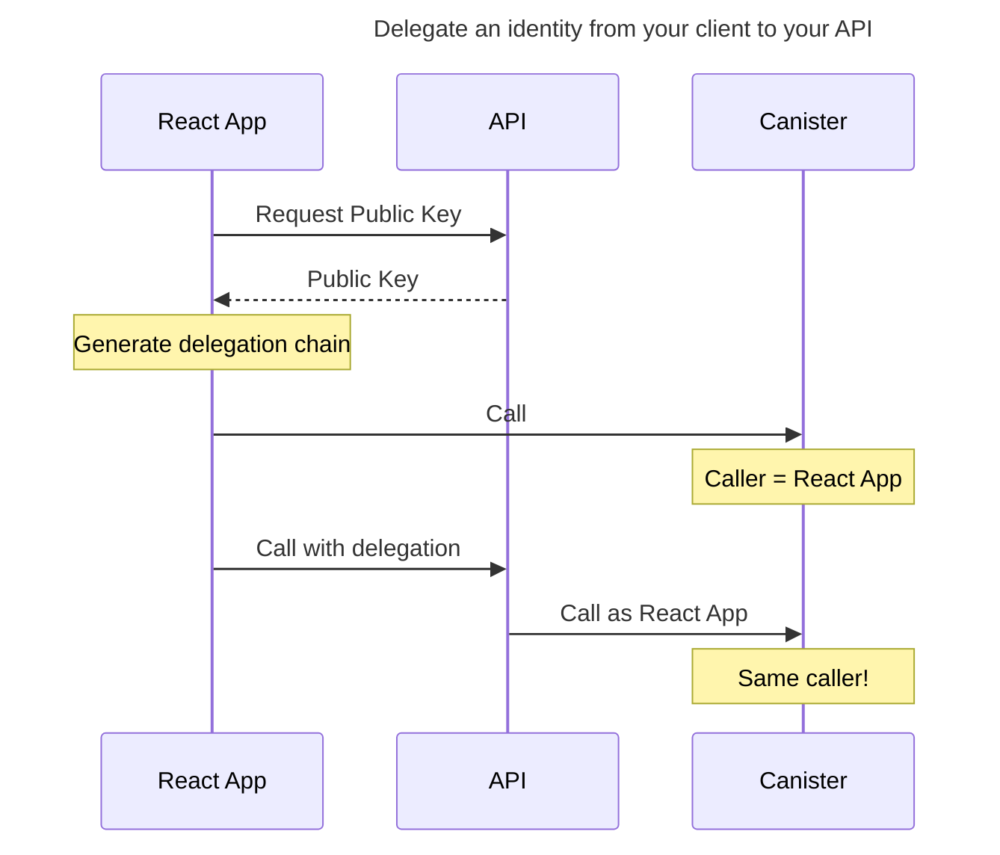

This is a minimal example of how to delegate a user's identity from your client application to your api, so that your api can make a call using that user's identity.

This pattern is useful for many cases when you want to move compute to the server for caching, process stability and so on, while maintaining caller based access control.



## Getting Started

This demo uses a simple canister and a nextjs app that handles both the api and the web application.

```bash
dfx start &
dfx deploy
npm run dev
```
